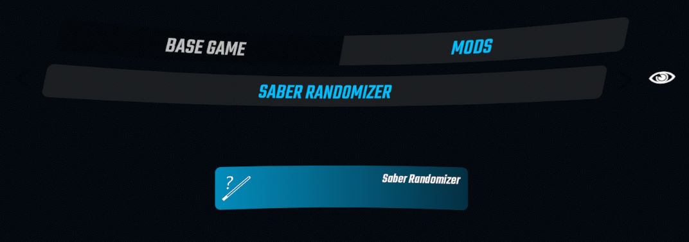

> [!NOTE]
> Some sabers have shaders that are compiled for the old unity version used prior to Beat Saber 1.29.4, and may not render properly at all. However, a wide range of sabers are still completely functional and it is up to the saber creators to update the shaders they used if they are broken.

To read more about migrating sabers to the newer versions of Beat Saber, read [this wiki page](https://bsmg.wiki/models/shader-migration.html).

# SaberRandomizer
PC Beat Saber mod that picks one of your custom sabers at random every time you play.

## Manual Installation
> [!IMPORTANT]
> In addition to BSIPA, you must have [AssetBundleLoadingTools](https://github.com/nicoco007/AssetBundleLoadingTools), [SiraUtil](https://github.com/Auros/SiraUtil), and [BeatSaberMarkupLanguage](https://github.com/monkeymanboy/BeatSaberMarkupLanguage) installed for this mod to load. Install them using your mod manager i.e. [BSManager](https://bsmg.wiki/pc-modding.html#bsmanager).

Place the contents of the unzipped folder from the latest [release](https://github.com/qqrz997/SaberRandomizer/releases/latest) into your Beat Saber installation folder. If you need more information regarding manual installation of mods [this wiki page](https://bsmg.wiki/pc-modding.html#manual-installation) will help. For further help with installing mods, join the [Beat Saber Modding Group](https://discord.gg/beatsabermods) discord server.

Older versions of SaberRandomizer are not supported. If you find issues using an older version then I won't be able to help.

- After launching Beat Saber with the mod successfully installed, a `CustomSabers` folder will be created in your Beat Saber game folder. Saber files should be placed here.

## Usage
The randomizer can be activated by accessing the mod tab in the player settings menu.

